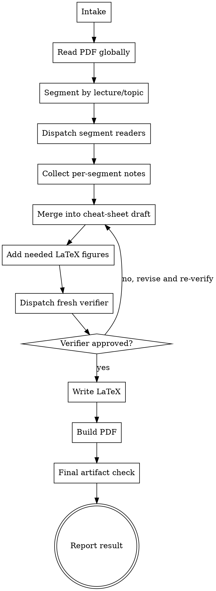

# Summarize Slides

Turn a long lecture PDF into a concise, exam-oriented LaTeX cheat sheet and compiled PDF with accurate page references, bilingual terminology, and only the diagrams that materially improve understanding.

**Core principle:** treat slide summarization as a controller workflow for long documents: read globally first, segment by lecture or topic, dispatch focused readers for each segment, merge into a single cheat-sheet draft, then run a fresh coverage verifier before building final artifacts.

## Non-Negotiables

- **REQUIRED COMPANION SKILL:** use `pdf` for PDF intake and reading. This workflow is not optional.
- **NO OTHER SKILLS:** when this skill applies, use only `summarize-slides` plus `pdf`. Do **not** invoke `dispatching-parallel-agents` or any other additional skill. Any task-splitting, reader dispatch, verifier separation, or parallelization logic needed for this workflow is already defined inside this skill.
- Check that locally installed `xelatex` is available before promising the required PDF output.
- Default deliverables are `.tex` and compiled `.pdf`, with the PDF treated as the required final artifact unless the user explicitly asks not to produce it.
- When this skill applies, a chat-only or inline summary is **not** a successful final deliverable unless the user explicitly asks for summary-only output or explicitly opts out of file creation.
- If the user gives parsed text, OCR text, extracted images, or page-by-page content originating from a lecture PDF instead of the raw PDF file, treat it as the same slide-summarization task and still produce the document artifacts by default.
- By default, place all generated artifacts in a single folder named `Summary - <pdf-stem>` inside the same directory that contains the source PDF. Do not scatter `.tex`, `.pdf`, helper assets, or intermediate files elsewhere.
- This containment rule is strict: create the output folder before any extraction, note-taking, OCR, or build step, and write every generated file into that folder from the start.
- Extracted text files are included in this rule. Files such as `<pdf-stem>_full.txt`, `<pdf-stem>_p1-5.txt`, OCR dumps, page-range extracts, verifier notes saved to disk, temporary LaTeX snippets, and any other intermediate `.txt`, `.md`, `.json`, `.tex`, image, or helper outputs must live inside `Summary - <pdf-stem>` only.
- Never place generated files next to the source PDF unless the user explicitly asked for that location. The source PDF's directory is not a scratch space.
- Here, `same directory that contains the source PDF` means the output folder sits alongside the PDF file itself. Example: if the source PDF is `.../lecture/foo.pdf`, the default output folder is `.../lecture/Summary - foo/`.
- The default writing style is Chinese-first.
- Important technical concepts, terms, and named distributions/theorems must include the original English in parentheses.
- Each summarized point should include the source slide page number or a tight page range by default. Omit citations only if an extraction failure is explicitly reported.
- The output style is `cheat sheet` in the sense of coverage, brevity, clarity, and fast lookup. It does **not** mean forced ultra-dense layout, automatic two-column formatting, or unreadable compression.
- Default layout is normal single-column reading unless the user explicitly asks for another layout.
- Do not produce a generic chapter summary when the user asked for exam points.
- Include formulas, important concepts, representative examples, and problem-solving techniques where they matter.
- Do not silently drop later sections of a long PDF because of context or time pressure.
- If extraction quality is too poor to preserve formulas, symbols, or page mapping, stop and ask rather than paraphrasing uncertain mathematics.
- If an important concept genuinely needs a figure to explain it clearly, include a LaTeX-drawn explanatory figure in the final document.
- Do not use screenshots or copied slide images as a substitute for a requested or necessary explanatory figure unless the user explicitly permits that fallback.

## Skill Boundary

- Allowed skills for this workflow: `summarize-slides` and `pdf` only.
- Forbidden: all other skills, even if they appear relevant to planning, dispatch, verification, or writing.
- Task or subagent mechanisms may still be used when the platform supports them, but that is an execution detail and does **not** justify loading another skill.

## Required Outcome

The default successful outcome for this skill is:

- a saved LaTeX source file named `Summary - <pdf-stem>.tex`
- a compiled PDF file named `Summary - <pdf-stem>.pdf`
- all generated files grouped in one output folder named `Summary - <pdf-stem>` inside the same directory as the source PDF unless the user explicitly requested another location
- no generated intermediate, extracted-text, OCR, notes, or helper files left outside that output folder
- a final response that reports the artifact paths and any blockers encountered

If no raw PDF path is available and the input is only source-derived text, OCR, extracted images, or page-by-page content:

- use the user-provided lecture name as the naming basis if one exists
- otherwise use the fallback stem `lecture-slides`
- default the output folder to `Summary - <chosen-stem>` in the current working directory unless the user specified another location
- name the artifacts `Summary - <chosen-stem>.tex` and `Summary - <chosen-stem>.pdf`

The following are **not** successful completions when this skill applies unless the user explicitly requested them:

- an inline chat summary only
- a summary draft that was never written to disk
- a claim that the work is complete before LaTeX was written and the PDF was compiled
- stopping at analysis, segmentation, or merged notes

## When to Use

Use this skill when the user wants any of the following from a PDF slide deck, lecture PDF, lecture notes PDF, or 课件 PDF:

- a study sheet
- a cheat sheet
- a key-points summary
- a formula sheet
- a concise review PDF
- exam-point extraction from slides
- 总结这个课件
- 把这个课件整理成复习资料
- 提炼这份 slides 的考点
- 做一个公式和概念速查表
- 做成考试前看的 cheat sheet
- 总结 lecture PDF
- 总结 slides
- 提炼课程讲义里的重点

Common trigger words and phrases:

- 课件
- slides
- lecture PDF
- 复习资料
- 考点总结
- 总结一下这个课件
- 提炼考点
- 公式速查表
- 概念速查表
- cheat sheet
- 考前整理
- 考试重点

Requests like `总结一下这个课件` still default to the artifact-producing workflow above. Do not reinterpret them as permission to answer only in chat.

Do not use this skill for:

- homework solving
- essay writing
- article summarization where slide-page lookup is unimportant
- `.pptx` workflows that are not already exported to PDF

## Portability

- Do not assume any custom skill other than `pdf` exists.
- This skill must be used together with `pdf`. Do not replace the `pdf` skill with an ad hoc fallback.
- Do not invoke any other skill to manage parallel work, planning, verification, or subagent dispatch. In particular, do not invoke `dispatching-parallel-agents`; follow the dispatch rules written here directly.
- If subagents are available and practical, prefer them for segment readers and a separate verifier. For very long decks, this is the preferred execution path when the platform supports it reliably.
- If subagents are not available, emulate the same roles sequentially: controller pass, per-segment read pass, merge pass, verifier pass.

## Workflow Model

- the `controller` owns intake, global read, segmentation, merge, style normalization, build choice, and final reporting
- each `segment-reader` owns one lecture chunk or topic chunk only
- one fresh `verifier` checks coverage, page references, bilingual terminology, and exam usefulness after merge
- the controller never treats segment notes as already trusted final output

## Dispatch Rules

This section replaces the need for any separate parallel-dispatch skill.

- Use one reader per independent lecture segment only when the segments can be understood without shared reasoning state.
- Good split examples: chapter blocks, explicit topic-title sections, or long independent page ranges.
- Do not split tightly coupled derivations, one multi-page proof chain, or one example whose steps depend heavily on each other across pages.
- When several segments are independent, dispatch them in parallel if the platform supports parallel subagents.
- When segments are not independent, process them sequentially even if parallel execution is available.
- The verifier must be a fresh pass with fresh context. Do not reuse one of the segment readers as the verifier.
- Each dispatched reader must receive only its own page range, the fixed return format, and the instruction not to write the final document.
- After all readers return, the controller must review for conflicts, merge them, and then hand the merged draft to a separate verifier pass.

## Execution Flow

## Step 1. Intake

- Confirm the source PDF path, or if no raw PDF is available, confirm the source-derived input and the naming basis for outputs.
- Confirm the output directory if the user already specified one.
- Determine expected outputs: `.tex`, `.pdf`, or both. Default is both, and the PDF is the required final artifact unless the user explicitly opts out of PDF output.
- Determine whether the user wants the whole deck or a subset. Default is the whole deck.
- Record any style instructions already provided by the user.
- If the user did not specify an output path, create and use a deterministic folder named `Summary - <pdf-stem>` inside the same directory as the source PDF and continue rather than waiting for unnecessary clarification.
- Treat creation of that folder as the first filesystem step of the workflow. Do not write extraction files to the source PDF directory and move them later; write them into the output folder immediately.

If there is no raw PDF path, choose the output stem using the rule from `Required Outcome` and create the deterministic output folder from that stem instead of waiting for clarification.

Default style unless the user says otherwise:

- language: Chinese
- layout: single-column normal reading
- purpose: exam review
- tone: concise, clear, non-verbose
- output: `Summary - <pdf-stem>.tex` and `Summary - <pdf-stem>.pdf` inside the folder `Summary - <pdf-stem>` that sits in the same directory as the source PDF

## Step 2. Check Build Environment

- Verify `xelatex` exists before promising the required compiled PDF.
- Prefer `xelatex` for Chinese text and math.
- If no working LaTeX engine exists, stop and report that the environment prerequisite for the required PDF output is missing. Do not stop at `.tex` only when PDF output is still required.

## Step 3. Read the PDF Globally First

Do not jump straight into chunk summaries.

- If any extracted text, OCR output, or saved notes are written to disk during this step, they must be written inside the output folder, never beside the source PDF.
- Read enough of the whole PDF to understand its macro-structure.
- Identify title pages, agenda pages, lecture separators, topic transitions, and summary slides.
- Build a segmentation map before deep reading.

For very long decks, segmentation plus per-segment reading is mandatory. Do not summarize a few-hundred-page deck in one shot.

Treat a deck as `very long` whenever one-pass reading would plausibly cause dropped coverage, unstable page mapping, or weak recall of later sections. In practice, any deck with a few hundred pages should be treated this way.

For long decks, the controller must first produce:

- overall topic list
- segment boundaries by page range
- expected number of lecture/topic segments
- suspected formula-heavy or concept-heavy regions
- a segmentation map covering the full page range

The segmentation map must cover all pages exactly once unless a page is explicitly marked as intentionally excluded, such as a duplicate title slide or blank separator page.

## Step 4. Segment the Deck

Use the coarsest segmentation that preserves topic integrity.

Prefer, in order:

1. lecture boundaries already present in the slides
2. explicit topic-title boundaries
3. major concept transitions

Do not split a tightly coupled derivation across multiple segment readers unless necessary.

If a segment boundary is not obvious from lecture titles or topic-title slides, record a short justification for that split.

## Step 5. Segment Reader Phase

If subagents are available and practical, dispatch one fresh `segment-reader` per independent segment.

If subagents are not available, the controller must still create separate per-segment notes before any merged summary is written. Do not read and summarize the full deck in one fused pass.

If the proposed segments are not independent enough to read safely in parallel, keep the same per-segment structure but execute sequentially.

Each segment-reader should return exactly these sections:

- `segment id`
- `page range covered`
- `main exam points`
- `core formulas`
- `key concepts with English terms`
- `important examples or recurring problem patterns`
- `problem-solving techniques or pitfalls`
- `figure candidates if any`
- `coverage concerns or uncertainty`

Segment readers are not allowed to:

- write the final document
- decide the final layout
- skip page references casually
- collapse the work into a generic prose summary

## Step 6. Merge into Cheat-Sheet Draft

The controller merges all segment notes into one coherent exam-review structure.

The target output is not a page-by-page narrative. It should be organized for fast review, typically by lecture or topic block, with concise bullets under each block.

Every major block should try to include:

- what to know
- formula(s)
- why it matters or when it appears in problems
- one representative example pattern if useful
- one practical solving hint if useful

## Style Rules for the Draft

- Chinese main text.
- Important terms in English in parentheses right after the Chinese term.
- Short bullets, not large explanatory paragraphs.
- Prefer exam language like `定义`, `公式`, `判据`, `技巧`, `典型例题`, `易错点`.
- Avoid filler transitions and lecture-storytelling.
- Avoid copying slide sentences verbatim unless a definition must remain exact.
- If a point is too detailed for a cheat sheet, compress it into the minimum needed to recall the method.
- If a point becomes so compressed that it loses meaning, expand slightly instead of forcing density.

## Page Reference Rules

- Attach a source page citation to each summarized point by default.
- Prefer exact pages.
- Use short page ranges only when one idea truly spans several nearby slides.
- Do not downgrade to very broad section-level ranges just to save effort.
- If page mapping is uncertain because extraction is ambiguous, say so explicitly and resolve it before finalizing. Missing citations are acceptable only when extraction failure is explicitly reported.

## Figure Rules

Only include figures that materially improve understanding.

Good uses:

- transform-domain geometry or ROC sketches
- pole-zero diagrams
- circuit or block-diagram equivalents
- timing or signal-shift diagrams
- simplified conceptual derivation sketches that materially reduce ambiguity

Do not add decorative figures.

When a figure is needed:

- draw it in LaTeX using `tikz`, `pgfplots`, or comparable reproducible tools
- simplify the figure to the conceptual minimum
- make sure it supports a specific point in the surrounding text

If an important figure cannot be reconstructed confidently from the source PDF plus direct page inspection, stop and ask rather than inventing a diagram.

## Verifier Phase

After the draft is merged, run a fresh verifier pass.

If subagents are available and practical, use a separate fresh `verifier` subagent. Do not reuse a reader subagent as the verifier.

The verifier must check all of the following:

- all major lecture/topic segments are represented
- no obvious lecture block was skipped
- formulas are not missing from formula-heavy sections
- key concept names include English where appropriate
- bullets include page references
- the style is concise and exam-oriented rather than generic summary prose
- representative examples or solving patterns are included when they matter
- any included figure is conceptually justified
- any clearly needed figure is not missing
- the output remains readable and is not aggressively compressed for density
- the verifier has checked the draft against the source PDF or source-derived page data rather than reviewing the draft alone
- cited pages or page ranges match the summarized concept or formula in sampled checks
- each segment in the segmentation map is represented in the final draft or explicitly justified as intentionally omitted

The verifier must return exactly these sections:

- `verdict` with one of: `APPROVED`, `APPROVED_WITH_NOTES`, `REJECTED`
- `coverage findings`
- `style and fidelity findings`
- `missing or weak areas`

If the verifier reports missing coverage, weak page citations, missing English labels, missing high-value examples, or source-drift concerns, fix the draft and re-run verification.

The verifier must not approve page-cited output without direct source-backed checking.

## Draft Gate

Do not move to LaTeX writing until:

- all expected segments were processed
- the merged draft exists
- page references are present and coherent for the summarized points, unless an explicit extraction failure note exists
- bilingual terminology is in place
- verifier verdict is `APPROVED`

If the verifier returns `APPROVED_WITH_NOTES`, resolve the notes and run a fresh verifier pass. Do not move to LaTeX writing on a stale verifier verdict.

Do not claim the task is complete at the draft stage. Draft completion is not document completion.

## LaTeX Output Rules

- Default to a normal single-column article-style layout.
- Use a clean, minimal preamble.
- Prioritize readability over density.
- Organize with short sections and bullets.
- Keep formulas in math mode.
- Keep figure code reproducible and local to the `.tex` file unless the user explicitly wants separate assets.

Recommended document qualities:

- easy to skim in exam review
- compact but not cramped
- mathematically legible
- page references easy to spot

## Build and Final Artifact Check

- Compile with `xelatex`.
- Confirm `.tex` and `.pdf` both exist.
- Confirm the LaTeX file was actually written to disk before the compile step.
- Confirm the compile command actually ran successfully with a successful exit status; do not infer success from reasoning alone.
- Treat any LaTeX fatal error or nonzero exit status as build failure even if a `.pdf` file was produced.
- Do not treat file existence alone as evidence of a successful build.
- Do a final artifact check for:
  - broken math
  - unreadable spacing
  - missing page references
  - lost Chinese rendering
  - figure placement problems
  - sections that became too verbose or too compressed

Compilation success is not enough. Readability and coverage still matter.

If the `.tex` file does not exist, the `.pdf` file does not exist, the compile step did not actually run successfully, or the build emitted a fatal LaTeX error, the task is not complete. Report the blocker instead of substituting a prose summary.

Before sending the final answer, verify from actual tool output or filesystem state that the required artifacts exist.

## Final Response Policy

- Do not use the final response to substitute for missing artifacts.
- Do not say the work is complete unless the files were actually created and checked.
- If blocked by missing `xelatex`, extraction quality, or another hard prerequisite, say so explicitly and stop rather than silently downgrading to chat output.
- When complete, the final response should point to the generated artifact paths first, then briefly summarize what was produced.
- If file output was not explicitly waived, do not stop at a polished inline summary; continue through writing, build, and artifact verification.

## Output Naming

Use deterministic names based on the source PDF stem:

- output folder: `Summary - <pdf-stem>` placed inside the same directory as the source PDF
- LaTeX source: `Summary - <pdf-stem>.tex`
- final PDF: `Summary - <pdf-stem>.pdf`
- any helper or intermediate generated files: keep them in the same folder and give them names derived from `<pdf-stem>` rather than generic names like `output.*` or `temp.*`
- extracted text and preprocessing files: save them inside that same folder with deterministic names such as `<pdf-stem>_full.txt`, `<pdf-stem>_p1-5.txt`, `<pdf-stem>_notes.md`, or similar; never place them in the source PDF directory

If the user specifies a custom output path or filename, follow that instead.

If no source PDF path exists, apply the fallback naming rule from `Required Outcome` instead of inventing a new naming scheme ad hoc.

## Common Failure Modes

- summarizing the PDF in one pass without segmentation
- losing exact page mapping during chunking
- producing a generic chapter summary instead of exam points
- replying with a chat-only summary even though the skill was triggered and file output was not explicitly waived
- scattering generated files outside the dedicated `Summary - <pdf-stem>` folder in the PDF's directory
- writing extraction or preprocessing files like `<pdf-stem>_full.txt` or page-range `.txt` files beside the source PDF instead of inside the dedicated output folder
- invoking another skill such as `dispatching-parallel-agents` even though this workflow already defines its own dispatch rules
- omitting English terms because they were added too late
- over-compressing layout because the phrase `cheat sheet` was taken literally
- skipping figures even when a concept clearly benefits from one
- using screenshots instead of LaTeX-drawn figures
- preserving only final formulas while dropping the example pattern or solving trick
- stopping after chunk summaries without a global synthesis pass
- stopping after drafting without writing `.tex`
- claiming completion without running `xelatex`
- compiling a PDF and assuming that means the result is good

## Rationalization Table

| Excuse | Reality |
|--------|---------|
| "I can summarize the whole PDF in one go" | Long decks need segmentation first or coverage will drift. |
| "Section-level page ranges are good enough" | This task is for lookup; point-level page citations matter. |
| "English terms are obvious" | Bilingual labels are a core deliverable, not optional polish. |
| "Cheat sheet means dense two-column cram format" | Here it means concise and efficient, not unreadable compression. |
| "Words are enough; I can skip figures" | Some concepts are materially clearer with a simple LaTeX figure. |
| "I can use slide screenshots" | The preferred output is a clean, reproducible LaTeX document. |
| "Final formulas are enough" | Exam prep often depends on example patterns and solving techniques. |
| "The user only said `总结一下这个课件`, so a chat summary is enough" | When this skill is triggered, summary means producing the document artifacts unless the user explicitly opts out. |
| "I already have the draft mentally, so I can report completion" | Mental or unwritten drafts are not deliverables. The `.tex` and `.pdf` files must actually exist. |
| "I can say it is done before running `xelatex`" | Completion requires an actual successful build or an explicit blocker report. |
| "It is simpler to save files next to the source PDF" | Keep generated artifacts contained in the `Summary - <pdf-stem>` folder inside the PDF's directory unless the user explicitly chose another location. |
| "I only put extracted `.txt` files next to the PDF temporarily" | Temporary extraction files still count as generated artifacts and must be created inside the output folder from the start. |
| "I should load another skill to help with subagent dispatch" | Do not load other skills for this workflow; use only `summarize-slides` plus `pdf`, and follow the dispatch rules written here. |
| "If the PDF compiles, it is done" | Build success does not verify coverage, readability, or fidelity. |

## Red Flags

- one-shot summary of a very long PDF
- no segmentation map
- no page references in bullets
- no English terms for core concepts
- generic prose summary instead of exam points
- final answer given before `.tex` and `.pdf` exist
- claiming completion based on intended steps instead of executed steps
- generated files spread across the original PDF directory instead of one `Summary - <pdf-stem>` folder
- extracted `.txt` files or other preprocessing artifacts appearing beside the source PDF
- no verifier pass after merge
- figures omitted despite clear conceptual need
- unreadable compressed formatting justified as `cheat sheet`

All of these mean: stop, fix the workflow, and re-run verification before finalizing.
